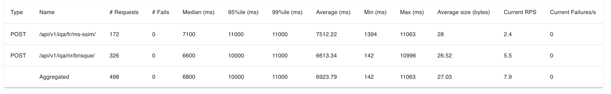

# IQA-webservice

A webservice build with python (FastAPI) that uses a piq library for Image Quality Assessment

## Dependencies

```toml
python = "3.10.*"
fastapi = "^0.115.4"
piq = "^0.8.0"
scikit-image = "^0.24.0"
uvicorn = "^0.32.0"
python-multipart = "^0.0.17"
pre-commit = "^4.0.1"
```

## How to run?

```bash
docker-compose up -d --build
```

Then go to `http://localhost:8000/` to see the API documentation.

## IQA methods used

#### BRISQUE

As an interface for measuring the quality of images without any provided reference, the choice fell on the BRISQUE
evaluator. It quite accurately shows the quality of the image in the range from 1 to 100 (in some cases more, depending
on the initial dataset), where 1 indicates that their image is of high quality and 100 is not high quality. Practical
experience has shown that images with a threshold higher than 50 can be considered low quality.

| Image                                      | Score     |
|--------------------------------------------|-----------|
|  | 3.2550659 |
|    | 69.478698 |

#### MS-SSIM

As an alternative to identifying the residual image quality after compression, I decided to use the MS-SSIM estimator as
it is well tested and PyTorch Image Quality library realized it well.

| Original image                             | Distorted Image                          | Score    |
|--------------------------------------------|------------------------------------------|----------|
|  |  | 0.864083 |

## Performance Test

I tried to load this service with 50 users.
As I hosted service on my local machine and locust too, the performance is not so good. Tested on MacBook Pro M1.

I think here I entered the limits of my local machine. Because I have only some GPU cores build in the Apple M1, the average of
requests is ~6s.
I think it might be highly improved with rather external GPU server or more powerful build-in GPU.

| network load                                        | CPU load                                     | request time without load test                                                 |
|-----------------------------------------------------|----------------------------------------------|--------------------------------------------------------------------------------|
|  |  |  |

Overall for this I launched additional python processes, but it is needed to be tested on a more powerful machine so
that maybe even different processes will be useless.

### How to run performance test?

In case you want to run your own performance test.

```bash
cd test
locust -f performance_test.py --host=http://x.x.x.x:8000
```

## References

- [PIQ Library](https://github.com/photosynthesis-team/piq) - PyTorch Image Quality.
- [IQA Benchmark](https://github.com/weizhou-geek/Image-Quality-Assessment-Benchmark?tab=readme-ov-file) - Benchmark
  that helped to choose.
- [IQA Dataset](https://github.com/icbcbicc/IQA-Dataset) - Used this dataset to test APIs (LIVE)